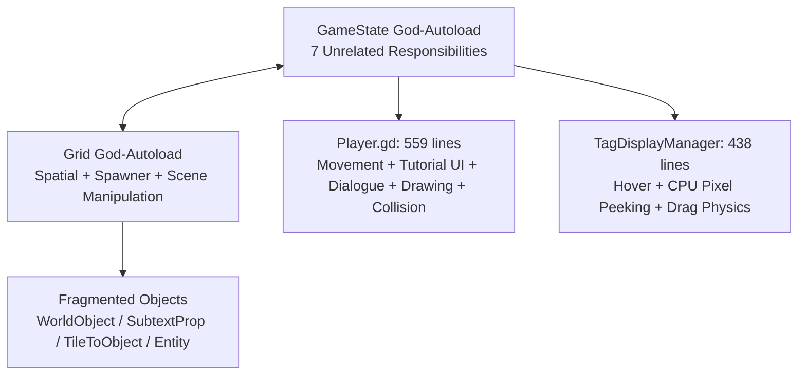
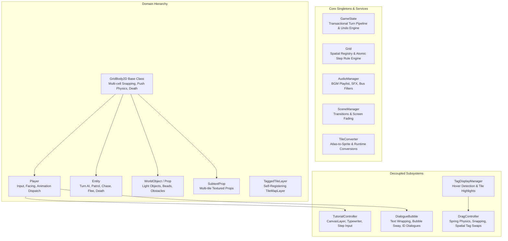
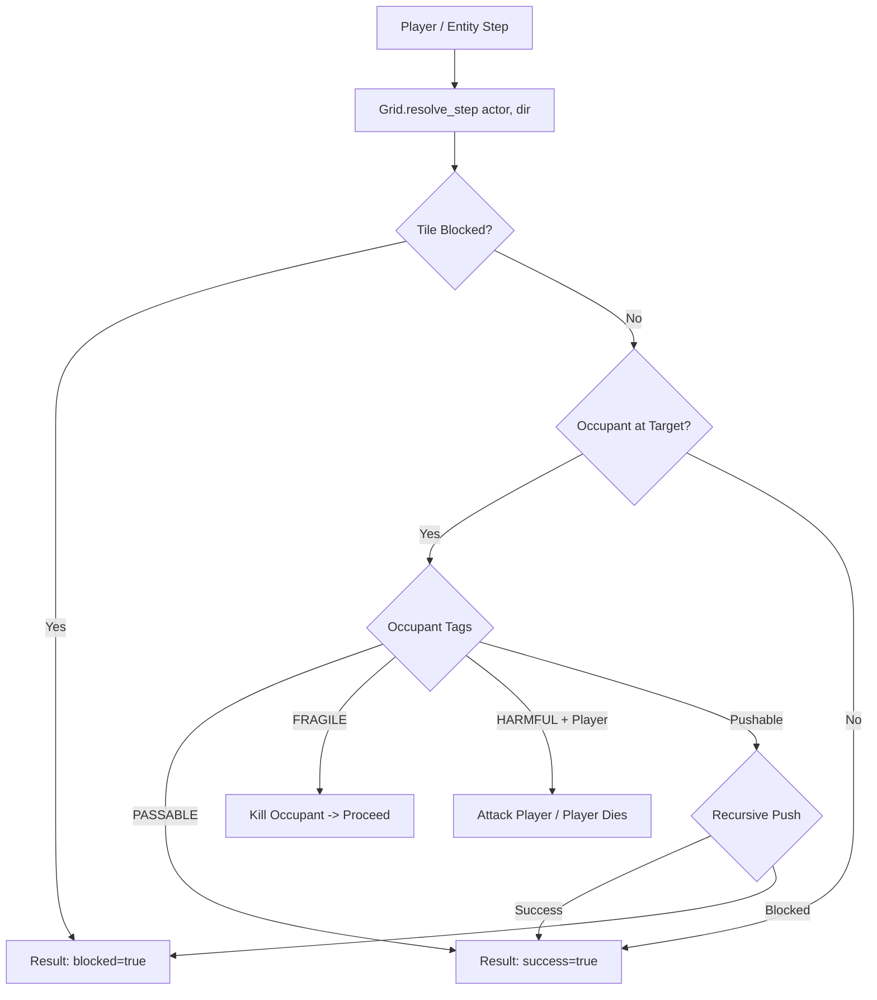
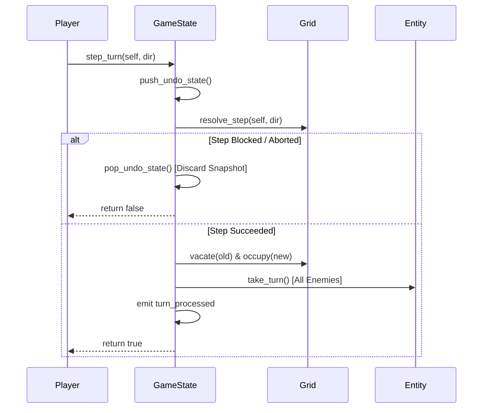
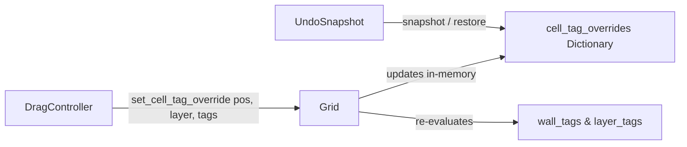
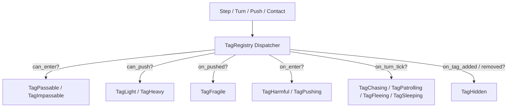
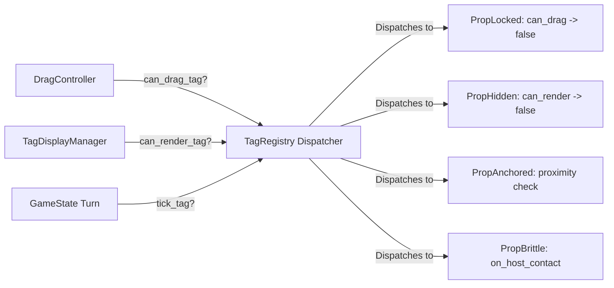

# SIKAPTala — Architecture & Extensibility Guide

> **A comprehensive technical reference detailing the architectural design, system patterns, module depths, and extensibility playbooks for SIKAPTala.**

---

## Table of Contents
1. [Architectural Transformation Overview](#1-architectural-transformation-overview)
2. [Detailed Record of Remediation Changes](#2-detailed-record-of-remediation-changes)
3. [Core Architectural Principles](#3-core-architectural-principles)
4. [Deepened Subsystem Pipelines](#4-deepened-subsystem-pipelines)
   - [Movement & Rule Resolution Engine](#movement--rule-resolution-engine)
   - [Transactional Turn Pipeline](#transactional-turn-pipeline)
   - [Spatial Tag Registry & Overrides](#spatial-tag-registry--overrides)
5. [Step-by-Step Extensibility Playbooks](#5-step-by-step-extensibility-playbooks)
   - [Playbook 1: Adding a New Tag](#playbook-1-adding-a-new-tag)
   - [Playbook 2: Adding a New Object / Prop / Hazard](#playbook-2-adding-a-new-object--prop--hazard)
   - [Playbook 3: Adding a New AI Entity Behavior](#playbook-3-adding-a-new-ai-entity-behavior)
   - [Playbook 4: Reworking UI & Subtext Interactions](#playbook-4-reworking-ui--subtext-interactions)
6. [GDScript 4 Best Practices & Engineering Standards](#6-gdscript-4-best-practices--engineering-standards)

---

## 1. Architectural Transformation Overview

### Before: The Monolithic & Circular Architecture
Prior to remediation, the codebase suffered from circular God-Autoloads, quadruplicated tile-slicing logic, pervasive duck-typing, scattered collision heuristics, and monolithic scripts exceeding 500 lines:



### After: Deep Modules, Single Interfaces & Atomic Transactions
The codebase has been refactored into deep domain modules with high locality and testable seams:



---

## 2. Detailed Record of Remediation Changes

The table below summarizes every architectural issue diagnosed in [`code review.md`](code%20review.md) and how it was remediated:

| Issue in Review | Root Cause | Remediated Solution | Key Files |
|---|---|---|---|
| **§1. Autoload Entanglement** | `GameState` managed Audio, Transitions, Scene Tree Injection, Turn Scheduling, and Collision. | Audio extracted to `AudioManager`; scene transitions extracted to `SceneManager`. Recursive string scraping removed. | [`audio_manager.gd`](scripts/services/audio_manager.gd)<br>[`scene_manager.gd`](scripts/services/scene_manager.gd)<br>[`game_state.gd`](scripts/core/game_state.gd) |
| **§1. Grid Scene Manipulation** | `Grid` spawned nodes, deleted tile cells, and managed live scene nodes. | Isolated into `TileConverter` utility. `Grid` is now a pure spatial index. | [`grid.gd`](scripts/core/grid.gd)<br>[`tile_converter.gd`](scripts/services/tile_converter.gd) |
| **§2.A Tile-Slicing Duplication** | 5 scripts duplicated `TileSetAtlasSource` texture extraction. | Consolidated into `TileConverter.build_sprite_from_tile()`. Deleted `tile_to_object.gd`. | [`tile_converter.gd`](scripts/services/tile_converter.gd) |
| **§2.B Duplicate TileMap Scripts** | `wall_layer.gd`, `floor_layer.gd`, `locked_wall_layer.gd` were 100% copy-pasted. | Unified into `TaggedTileLayer` with exported default tags and self-registration. | [`tagged_tile_layer.gd`](scripts/objects/tagged_tile_layer.gd) |
| **§2.C Fragmented Object Hierarchy** | `world_object`, `subtext_prop`, `entity` separately implemented push and occupancy. | Unified base class `GridBody2D` handles multi-cell occupancy, movement tweens, and push physics. | [`grid_body_2d.gd`](scripts/core/grid_body_2d.gd)<br>[`world_object.gd`](scripts/objects/world_object.gd)<br>[`subtext_prop.gd`](scripts/objects/subtext_prop.gd)<br>[`entity.gd`](scripts/entities/entity.gd) |
| **§3. Runtime Crash Traps** | Missing `unregister_object`, missing `register_tilemap`, multi-tile vacate bug. | Added symmetrical unregistering; multi-cell occupancy looping in `_vacate_cells()` / `_occupy_cells()`. | [`game_state.gd`](scripts/core/game_state.gd)<br>[`grid_body_2d.gd`](scripts/core/grid_body_2d.gd) |
| **§4. Dual Tag Typing** | Split between 7-item enum in `grid.gd` and raw string literals in other files. | Created canonical `TagDef` with 15 tags and bidirectional conversion helpers. | [`tag_def.gd`](scripts/core/tag_def.gd)<br>[`tag_label.gd`](scripts/ui/tag_label.gd) |
| **§5. God-File: `player.gd`** | 559 lines handling tutorial sequences, dialogue UI, sway, and drawing. | Extracted `TutorialController` and `DialogueBubble`. `player.gd` reduced by 56% to ~246 lines. | [`player.gd`](scripts/player/player.gd)<br>[`tutorial_controller.gd`](scripts/player/tutorial_controller.gd)<br>[`dialogue_bubble.gd`](scripts/player/dialogue_bubble.gd) |
| **§5. CPU Pixel Peeking** | `img.get_pixel()` called per-frame on the CPU in `_process`. | Replaced with discrete integer grid cell queries (`get_cell_source_id`). | [`tag_display_manager.gd`](scripts/ui/tag_display_manager.gd) |
| **§5. Drag Monolith** | `tag_display_manager.gd` mixed hover display with drag springs and swap logic. | Extracted `DragController`. Reduced display manager to 261 lines. | [`drag_controller.gd`](scripts/ui/drag_controller.gd)<br>[`tag_display_manager.gd`](scripts/ui/tag_display_manager.gd) |
| **§6. Incomplete Undo System** | Missing `layer_tags`, missing `regions`, destroyed tiles lost forever, dead entities lost to `queue_free()`. | Built typed `UndoSnapshot`, deferred death via `GameState.mark_dead()`, and tile restoration on undo. | [`game_state.gd`](scripts/core/game_state.gd)<br>[`grid_body_2d.gd`](scripts/core/grid_body_2d.gd)<br>[`tile_converter.gd`](scripts/services/tile_converter.gd) |
| **Deepening 1: Rule Engine** | Movement and collision checks duplicated across player, entity, and gamestate. | Unified into `Grid.resolve_step(actor, dir)` returning structured resolution results. | [`grid.gd`](scripts/core/grid.gd)<br>[`player.gd`](scripts/player/player.gd)<br>[`entity.gd`](scripts/entities/entity.gd) |
| **Deepening 2: Turn Pipeline** | Distributed step choreography across input handling and loose signal handlers. | Encapsulated into atomic `GameState.step_turn(actor, dir)`. | [`game_state.gd`](scripts/core/game_state.gd)<br>[`player.gd`](scripts/player/player.gd) |
| **Deepening 3: Spatial Tags** | Tag dragging spawned runtime SubtextRegion nodes into scene tree. | Replaced with in-memory `cell_tag_overrides` dictionary, eliminating transient scene mutation. | [`grid.gd`](scripts/core/grid.gd)<br>[`drag_controller.gd`](scripts/ui/drag_controller.gd) |

---

## 3. Core Architectural Principles

When building new features for SIKAPTala, adhere to these three golden rules:

### Principle 1: The Tag-First Rule (Composition over Type Checking)
Never check what class a node is to determine its behavior. Check its **tags**:
- ❌ **Bad**: `if occupant is FragileBox: occupant.shatter()`
- ✅ **Good**: `if "FRAGILE" in occupant.tags: occupant.die()`
- ❌ **Bad**: `if layer.name.contains("Wall"): block()`
- ✅ **Good**: `if "IMPASSABLE" in Grid.get_wall_tags(pos): block()`

This ensures that any object, tile, or entity can acquire any behavior dynamically when tags are swapped.

### Principle 2: The Spatial Grid vs. Scene Tree Separation
- **`Grid`** is the spatial database of coordinates, cell occupancy, step resolution, and tag queries.
- **Scene Nodes** are the visual representations.
- Never manipulate scene trees directly inside `Grid`. If a tile needs to become an object, route it through `TileConverter`.

### Principle 3: The State Transaction Rule (Undo Compatibility)
Any game mechanic that alters state (moving, swapping tags, killing an entity, converting a tile) must be reversible by the Undo system:
1. **Never call `queue_free()` directly during gameplay.** Call `die()`, which routes through `GameState.mark_dead()`.
2. **Push undo state BEFORE making changes**: Call `GameState.push_undo_state()` before the player moves or before tags are swapped.

---

## 4. Deepened Subsystem Pipelines

### Movement & Rule Resolution Engine

The `Grid.resolve_step(actor, dir)` engine consolidates all physics, pushing propagation, tag interactions, and harmful checks into a single atomic function:



### Transactional Turn Pipeline

`GameState.step_turn(actor, dir)` coordinates snapshotting, rule resolution, AI execution, and turn completion:



### Spatial Tag Registry & Overrides

Tag dragging in Subtext mode no longer creates transient scene nodes. All tag overrides are tracked in pure spatial memory:



### Modular Tag Engine & Strategy Dispatch (Baba Is You Inspired)

Behaviors in SUBTEXT are governed by modular `TagRule` strategies registered in `TagRegistry`. Instead of hardcoding tag checks in movement or turn loops, the engine dispatches lifecycle hooks to isolated strategy objects:



---

## 5. Step-by-Step Extensibility Playbooks

---

### Playbook 1: Adding a New Tag (The Modular TagRule Strategy)

Adding a new tag requires **zero modifications** to existing core movement or entity scripts.

#### Step 1: Register the Tag in [`scripts/core/tag_def.gd`](scripts/core/tag_def.gd)
Add the tag name to `TagDef.Tag` enum:
```gdscript
enum Tag {
    IMPASSABLE, LOCKED, PASSABLE, FRAGILE,
    HEAVY, LIGHT, INTERACTABLE, COLD,
    SLEEPING, CHASING, PATROLLING, FLEEING,
    PUSHING, HARMFUL, HIDDEN,
    BURNING  # <-- Added
}
```

#### Step 2: Assign a Tag Color in [`scripts/ui/tag_label.gd`](scripts/ui/tag_label.gd)
Add the display color for the substrate UI overlay:
```gdscript
var tag_colors: Dictionary = {
    # ...
    "BURNING": "#ff5500",  # Fiery orange
}
```

#### Step 3: Create an Isolated TagRule Script in `scripts/tags/rules/tag_burning.gd`
Inherit from `TagRule` and implement any required lifecycle hooks:
```gdscript
class_name TagBurning
extends "res://scripts/core/tag_rule.gd"

func on_enter(actor: Node2D, _target_pos: Vector2i, _occupant: Node2D) -> void:
    if actor != null and actor.has_method("die"):
        actor.die()

func on_turn_tick(body: Node2D) -> void:
    # Spread fire to adjacent fragile objects
    if body is GridBody2D:
        var grid_body := body as GridBody2D
        for dir: Vector2i in [Vector2i.UP, Vector2i.DOWN, Vector2i.LEFT, Vector2i.RIGHT]:
            var occ: Node2D = Grid.get_occupant(grid_body.grid_pos + dir)
            if occ != null and "FRAGILE" in occ.get("tags"):
                if occ.has_method("die"):
                    occ.die()
```

#### Step 4: Register the Rule in `TagRegistry`
Add the registration to `scripts/core/tag_registry.gd`:
```gdscript
const TagBurning = preload("res://scripts/tags/rules/tag_burning.gd")

# In _register_default_rules():
register_rule("BURNING", TagBurning.new())
```

---

### Playbook 2: Adding a New Object / Prop / Hazard

There are two primary ways to create objects and props:

#### Option A: Creating a Textured Prop (`SubtextProp`) in `scenes/props/`
For furniture and world decorations (beds, bookshelves, crates, vases, chests, etc.):
1. Create a scene in `scenes/props/<name>.tscn` with a root `Node2D` attaching [`scripts/objects/subtext_prop.gd`](scripts/objects/subtext_prop.gd).
2. Set the exported properties in the Inspector:
   - `atlas_coords`: Vector2i tile coordinate on the tileset atlas.
   - `atlas_size`: Dimensions in tiles (e.g. `(2, 2)` for a bed, `(1, 2)` for a bookshelf).
   - `tags`: Initial tags (e.g. `["PASSABLE", "INTERACTABLE"]` or `["LIGHT"]`).
   - `id` and `custom_dialogues`.
3. `SubtextProp` automatically slices the region from `tileset.tres`, configures its `Sprite2D`, snaps to grid, and registers multi-cell occupancy with `Grid` and `GameState`.

#### Option B: Creating a Custom Entity Extending `GridBody2D`
For unique scripted mechanics (e.g. `SpikeTrap`, `Mirror`, `Portal`):
```gdscript
class_name SpikeTrap
extends GridBody2D

@export var is_active: bool = true

func _on_ready() -> void:
    if tags.is_empty():
        tags = ["HARMFUL", "IMPASSABLE"]
    GameState.register_object(self)

func _on_die() -> void:
    GameState.unregister_object(self)
    Grid.refresh_all_tags()
```
Create the `.tscn` in `scenes/props/` or `scenes/objects/`. `GridBody2D` handles grid snapping, occupancy registration, tween movement, push handling, and undo/redo support.

---

### Playbook 3: Adding a New Autonomous AI Behavior

Because all entities and objects are `GridBody2D` instances, adding autonomous behavior (e.g., `WANDERING`, `MIMIC`) is simply creating a new `TagRule` with an `on_turn_tick` implementation:

1. **Add tag to `TagDef`** (e.g. `WANDERING`).
2. **Create `scripts/tags/rules/tag_wandering.gd`**:
```gdscript
class_name TagWandering
extends "res://scripts/core/tag_rule.gd"

func on_turn_tick(body: Node2D) -> void:
    if not (body is GridBody2D):
        return
    var grid_body: GridBody2D = body as GridBody2D
    if not grid_body.is_alive or "SLEEPING" in grid_body.tags:
        return
    
    var dirs: Array[Vector2i] = [Vector2i.UP, Vector2i.DOWN, Vector2i.LEFT, Vector2i.RIGHT]
    var random_dir: Vector2i = dirs[randi() % dirs.size()]
    grid_body.step(random_dir)
```
3. **Register in `TagRegistry`**:
```gdscript
register_rule("WANDERING", TagWandering.new())
```
4. Attach `tags = ["WANDERING"]` to any enemy, NPC, or even a crate/bed, and it will immediately wander during the turn pipeline with zero custom code!

---

### Playbook 4: Reworking UI & Subtext Interactions

1. **Tag Drag & Drop Mechanics**: Handled entirely inside [`scripts/ui/drag_controller.gd`](scripts/ui/drag_controller.gd).
2. **Hover Detection & Tile Highlights**: Handled inside [`scripts/ui/tag_display_manager.gd`](scripts/ui/tag_display_manager.gd).
3. **Subtext Overlay Shader & Fullscreen Post-Processing**: Configured in [`scripts/ui/subtext_overlay.gd`](scripts/ui/subtext_overlay.gd) and connected to `GameState.substrate_toggled`.

---

### Playbook 5: Adding a Tag Property / Modifier (The Interceptor Pattern)

Tags themselves can have modular **Tag Properties** (modifiers/traits) that alter how tags are dragged, rendered, or decayed, without adding hardcoded boolean flags or scattered `if` statements across UI and gameplay code.



#### Supported Tag Property Catalog:

| Property | Behavior | Status |
|---|---|---|
| **`LOCKED`** | Tag cannot be dragged or detached from the host object. | Active |
| **`HIDDEN`** | Tag is invisible in Subtext view until revealed by a lens/action. | Active |
| **`ANCHORED`** | Tag can only be dragged if the player stands adjacent to the host. | Active |
| **`VOLATILE`** | Snaps back to origin after $N$ turns (displacement budget). | *Placeholder Specification* |
| **`EXPIRING`** | Has a turn counter; decays and dissolves when depleted. | *Placeholder Specification* |
| **`DORMANT`** | Tag is inactive until an in-game trigger/condition activates it. | Active |
| **`SPREADING`** | Replicates the tag onto any object the host touches. | Active |
| **`BRITTLE`** | Tag shatters and disappears if the host is pushed or hit. | Active |

#### Adding a New Tag Property Strategy:
1. Create a strategy in `scripts/tags/properties/prop_<name>.gd` implementing hooks:
```gdscript
class_name PropAnchored
extends RefCounted

func can_drag(tag: SubtextTag, drag_pos: Vector2i, player_pos: Vector2i) -> bool:
    var dist = (drag_pos - player_pos).abs()
    return (dist.x + dist.y) <= 1 # Must be adjacent!
```
2. Register in `TagRegistry`:
```gdscript
TagRegistry.register_property_rule("ANCHORED", PropAnchored.new())
```

---

## 6. GDScript 4 Best Practices & Engineering Standards

1. **Strict Static Typing**: Always explicitly type variables, parameters, and return types (`var pos: Vector2i = ...`). Never rely on `:=` when the RHS expression returns a `Variant` (e.g., `event.keycode`, `get_global_mouse_position()`, `lerp()`).
2. **Node Names are `StringName`**: When doing ternary expressions with strings, always cast node names: `str(layer.name) if layer else ""`.
3. **Symmetrical Registration**: Every object that registers on `_ready()` MUST unregister on `_exit_tree()` or `die()` (`GameState.unregister_object()`, `Grid.vacate()`).
4. **Deferred Tile Conversions**: Use `TileConverter.convert_to_prop_if_unoccupied()` when converting static tiles into interactive objects at runtime.
5. **Interceptor Strategy Pattern**: Never check tag properties with scattered `if` statements across UI scripts. Always query `TagRegistry` dispatch methods (`can_drag_tag`, `can_render_tag`).
