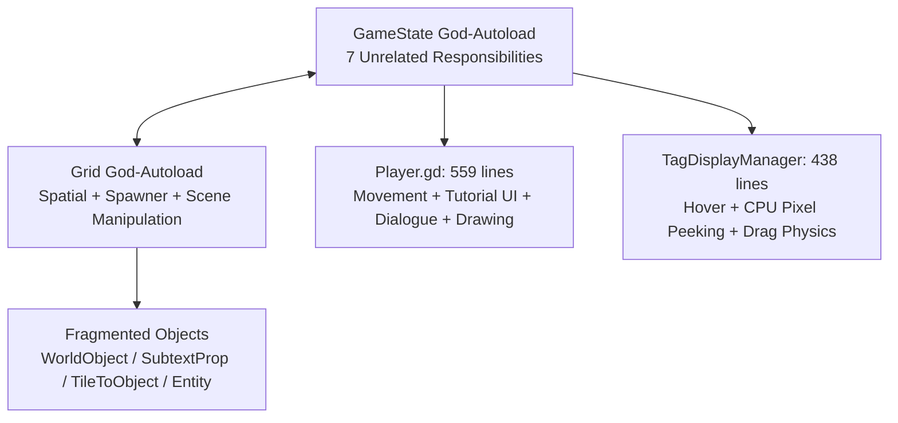
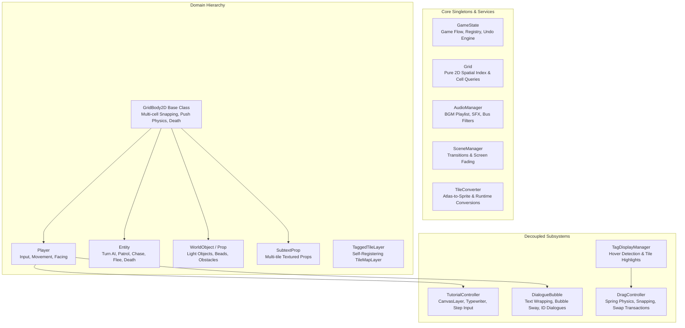

# SIKAPTala — Architecture & Extensibility Guide

> **A comprehensive technical reference detailing the architectural remediation from [`code review.md`](code%20review.md), system designs, and extensibility playbooks for future game development.**

---

## Table of Contents
1. [Architectural Transformation Overview](#1-architectural-transformation-overview)
2. [Detailed Record of Remediation Changes](#2-detailed-record-of-remediation-changes)
3. [Core Architectural Principles](#3-core-architectural-principles)
4. [Step-by-Step Extensibility Playbooks](#4-step-by-step-extensibility-playbooks)
   - [Playbook 1: Adding a New Tag](#playbook-1-adding-a-new-tag)
   - [Playbook 2: Adding a New Object / Prop / Hazard](#playbook-2-adding-a-new-object--prop--hazard)
   - [Playbook 3: Adding a New AI Entity Behavior](#playbook-3-adding-a-new-ai-entity-behavior)
   - [Playbook 4: Reworking UI & Subtext Interactions](#playbook-4-reworking-ui--subtext-interactions)
5. [GDScript 4 Best Practices & Engineering Standards](#5-gdscript-4-best-practices--engineering-standards)

---

## 1. Architectural Transformation Overview

### Before: The Monolithic & Circular Architecture
Prior to remediation, the codebase suffered from circular God-Autoloads, quadruplicated tile-slicing logic, pervasive duck-typing, and monolithic scripts exceeding 500 lines:



### After: Decoupled, Single-Responsibility System
The codebase has been refactored into focused services, typed class hierarchies, and decoupled controllers:



---

## 2. Detailed Record of Remediation Changes

The table below summarizes every architectural issue diagnosed in [`code review.md`](code%20review.md) and how it was remediated:

| Issue in Review | Root Cause | Remediated Solution | Key Files |
|---|---|---|---|
| **§1. Autoload Entanglement** | `GameState` managed Audio, Transitions, Scene Tree Injection, Turn Scheduling, and Collision. | Audio extracted to `AudioManager`; scene transitions extracted to `SceneManager`. Recursive string scraping removed. | [`audio_manager.gd`](scripts/services/audio_manager.gd)<br>[`scene_manager.gd`](scripts/services/scene_manager.gd)<br>[`game_state.gd`](scripts/core/game_state.gd) |
| **§1. Grid Scene Manipulation** | `Grid` spawned nodes, deleted tile cells, and managed live scene nodes. | Isolated into `TileConverter` utility. `Grid` is now a pure spatial index. | [`grid.gd`](scripts/core/grid.gd)<br>[`tile_converter.gd`](scripts/services/tile_converter.gd) |
| **§2.A Tile-Slicing Duplication** | 5 scripts duplicated `TileSetAtlasSource` texture extraction. | Consolidated into `TileConverter.build_sprite_from_tile()`. Deleted `tile_to_object.gd`. | [`tile_converter.gd`](scripts/services/tile_converter.gd) |
| **§2.B Duplicate TileMap Scripts** | `wall_layer.gd`, `floor_layer.gd`, `locked_wall_layer.gd` were 100% copy-pasted. | Unified into `TaggedTileLayer` with exported default tags and self-registration. | [`tagged_tile_layer.gd`](scripts/objects/tagged_tile_layer.gd) |
| **§2.C Fragmented Object Hierarchy** | `world_object`, `subtext_prop`, `entity` separately implemented push and occupancy. | Unified base class `GridBody2D` handles multi-cell occupancy, movement tweens, and push physics. | [`grid_body_2d.gd`](scripts/core/grid_body_2d.gd)<br>[`world_object.gd`](scripts/objects/world_object.gd)<br>[`subtext_prop.gd`](scripts/objects/subtext_prop.gd)<br>[`entity.gd`](scripts/entities/entity.gd) |
| **§3. Runtime Crash Traps** | Missing `unregister_object`, missing `register_tilemap`, multi-tile vacate bug. | Added symmetrical unregistering; multi-cell occupancy looping in `_vacate_cells()` / `_occupy_cells()`. | [`game_state.gd`](scripts/core/game_state.gd)<br>[`grid_body_2d.gd`](scripts/core/grid_body_2d.gd) |
| **§4. Dual Tag Typing** | Split between 7-item enum in `grid.gd` and raw string literals in other files. | Created canonical `TagDef` with 15 tags and bidirectional conversion helpers. | [`tag_def.gd`](scripts/core/tag_def.gd)<br>[`tag_label.gd`](scripts/ui/tag_label.gd) |
| **§5. God-File: `player.gd`** | 559 lines handling tutorial sequences, dialogue UI, sway, and drawing. | Extracted `TutorialController` and `DialogueBubble`. `player.gd` reduced by 56% to ~246 lines. | [`player.gd`](scripts/player/player.gd)<br>[`tutorial_controller.gd`](scripts/player/tutorial_controller.gd)<br>[`dialogue_bubble.gd`](scripts/player/dialogue_bubble.gd) |
| **§5. CPU Pixel Peeking** | `img.get_pixel()` called per-frame on the CPU in `_process`. | Replaced with discrete integer grid cell queries (`get_cell_source_id`). | [`tag_display_manager.gd`](scripts/ui/tag_display_manager.gd) |
| **§5. Drag Monolith** | `tag_display_manager.gd` mixed hover display with drag springs and swap logic. | Extracted `DragController`. Reduced display manager to 261 lines. | [`drag_controller.gd`](scripts/ui/drag_controller.gd)<br>[`tag_display_manager.gd`](scripts/ui/tag_display_manager.gd) |
| **§6. Incomplete Undo System** | Missing `layer_tags`, missing `regions`, destroyed tiles lost forever, dead entities lost to `queue_free()`. | Built typed `UndoSnapshot`, deferred death via `GameState.mark_dead()`, and tile restoration on undo. | [`game_state.gd`](scripts/core/game_state.gd)<br>[`grid_body_2d.gd`](scripts/core/grid_body_2d.gd)<br>[`tile_converter.gd`](scripts/services/tile_converter.gd) |

---

## 3. Core Architectural Principles

When building new features for SIKAPTala, adhere to these three golden rules:

### Principle 1: The Tag-First Rule (Composition over Type Checking)
Never check what class a node is to determine its behavior. Check its **tags**:
- ❌ **Bad**: `if occupant is FragileBox: occupant.shatter()`
- ✅ **Good**: `if "FRAGILE" in occupant.tags: occupant.die()`
- ❌ **Bad**: `if layer.name.contains("Wall"): block()`
- ✅ **Good**: `if "IMPASSABLE" in Grid.get_wall_tags(pos): block()`

This ensures that any object, tile, or entity can acquire any behavior dynamically when tags are swapped.

### Principle 2: The Spatial Grid vs. Scene Tree Separation
- **`Grid`** is the spatial database of coordinates, cell occupancy, and tag queries.
- **Scene Nodes** are the visual representations.
- Never manipulate scenes inside `Grid`. If a tile needs to become an object, route it through `TileConverter`.

### Principle 3: The State Transaction Rule (Undo Compatibility)
Any game mechanic that alters state (moving, swapping tags, killing an entity, converting a tile) must be reversible by the Undo system:
1. **Never call `queue_free()` directly during gameplay.** Call `die()`, which routes through `GameState.mark_dead()`.
2. **Push undo state BEFORE making changes**: Call `GameState.push_undo_state()` before the player moves or before tags are swapped.

---

## 4. Step-by-Step Extensibility Playbooks

---

### Playbook 1: Adding a New Tag

Let's say you want to add a new tag: **`BURNING`** (destroys fragile objects on contact and spreads to neighbors).

#### Step 1: Register the Tag in [`scripts/tag_def.gd`](scripts/tag_def.gd)
Add the tag name to `TagDef.Tag` enum:
```gdscript
enum Tag {
    IMPASSABLE, LOCKED, PASSABLE, FRAGILE,
    HEAVY, LIGHT, INTERACTABLE, COLD,
    SLEEPING, CHASING, PATROLLING, FLEEING,
    PUSHING, HARMFUL, HIDDEN,
    BURNING  # <-- Added
}
```

#### Step 2: Assign a Tag Color in [`scripts/tag_label.gd`](scripts/tag_label.gd)
Add the display color for the substrate UI overlay:
```gdscript
var tag_colors: Dictionary = {
    # ...
    "BURNING": "#ff5500",  # Fiery orange
}
```

#### Step 3: Implement the Behavior Hook
Find the appropriate system where the tag operates:
- If it affects **movement/stepping**, check in `GridBody2D.push()` or `player._attempt_move()`.
- If it affects **turn processing**, add logic to `GameState.process_turn()` or `Entity.take_turn()`:
```gdscript
# Example in GameState or Entity:
if "BURNING" in tags:
    var neighbor_cells = [grid_pos + Vector2i.UP, grid_pos + Vector2i.DOWN, ...]
    for n in neighbor_cells:
        var occ = Grid.get_occupant(n)
        if occ and "FRAGILE" in occ.tags:
            occ.die()
```

---

### Playbook 2: Adding a New Object / Prop / Hazard

To create a new pushable or interactive object (e.g. `SpikeTrap`, `Mirror`, `HeavyBoulder`):

#### Step 1: Create the Script Extending `GridBody2D`
```gdscript
class_name SpikeTrap
extends GridBody2D

@export var is_active: bool = true

func _on_ready() -> void:
    # Set default tags if not configured in Inspector
    if tags.is_empty():
        tags = ["HARMFUL", "IMPASSABLE"]
    GameState.register_object(self)

func _on_die() -> void:
    GameState.unregister_object(self)
    Grid.refresh_all_tags()

# Optional: Custom push rules
func can_be_pushed(dir: Vector2i) -> bool:
    return "LIGHT" in tags and not is_active
```

#### Step 2: Create the Scene (`SpikeTrap.tscn`)
- Root node: `Node2D` with `SpikeTrap.gd` attached.
- Child node: `Sprite2D` or `AnimatedSprite2D`.
- That's it! `GridBody2D` automatically handles grid snapping, occupancy registration, tween movement, and undo/redo support.

---

### Playbook 3: Adding a New AI Entity Behavior

To create a new AI enemy behavior (e.g. `WANDERING`, `MIMIC`):

1. **Add tag to `TagDef`** (e.g. `WANDERING`).
2. **Add behavior branch in [`scripts/entity.gd`](scripts/entity.gd)** inside `take_turn()`:
```gdscript
func take_turn() -> void:
    if not is_alive: return
    if "SLEEPING" in tags: return
    
    if "CHASING" in tags:
        _do_chase()
    elif "WANDERING" in tags:
        _do_wander()  # <-- Your new behavior function
    elif "PATROLLING" in tags:
        _do_patrol()
    # ...
```
3. **Implement the function**:
```gdscript
func _do_wander() -> void:
    var random_dirs = [Vector2i(1, 0), Vector2i(-1, 0), Vector2i(0, 1), Vector2i(0, -1)]
    random_dirs.shuffle()
    for dir in random_dirs:
        if _move_entity(dir):
            break
```

---

### Playbook 4: Reworking UI & Subtext Interactions

The Subtext interface is separated cleanly into two layers:

1. **[`TagDisplayManager`](scripts/tag_display_manager.gd)** (Visual Presentation):
   - Responsible for: Raycasting hovered tiles/objects, positioning floating `TagLabel` UI, and driving hover pulse shaders.
   - If you want to change how tags look or add tooltips, modify `TagLabel.gd` or `TagDisplayManager.gd`.

2. **[`DragController`](scripts/drag_controller.gd)** (Interaction & Physics):
   - Responsible for: Mouse dragging, drag velocity spring calculation, slot snapping preview, and performing tag swaps.
   - If you want to change drag feel (e.g., gamepad support, tap-to-swap instead of drag), customize `DragController.gd` without touching tile highlights.

---

## 5. GDScript 4 Best Practices & Engineering Standards

### 1. Strict Static Typing (No Inferred Variants)
Godot 4's compiler emits errors/warnings when inferring types from Variant expressions. Always specify explicit type annotations:

```gdscript
# ❌ Bad: Inferred from Variant function
var mouse_pos := get_global_mouse_position()
var alpha := lerp(0.3, 0.8, p)
var dirs := [Vector2i(1, 0)]  # Untyped Array

# ✅ Good: Explicit type annotations
var mouse_pos: Vector2 = get_global_mouse_position()
var alpha: float = lerpf(0.3, 0.8, p)
var dirs: Array[Vector2i] = [Vector2i(1, 0)]
```

### 2. Node Communication: "Call Down, Signal Up"
- **Parent to Child**: Direct method call (e.g. `dialogue.show_for(object)`).
- **Child to Parent**: Emit signals (e.g. `drag.swap_completed.connect(_on_swap_completed)`).
- **Cross-System**: Use domain singletons (`GameState`, `Grid`, `AudioManager`, `SceneManager`).

### 3. Autoload Boundaries
Before adding anything to an Autoload, ask: *"Is this truly global game state, or does it belong to a local level/scene?"*
- **`GameState`**: Turn flow, registry of active entities, undo stack.
- **`Grid`**: 2D coordinate calculations, spatial lookup.
- **`AudioManager`**: Sound effects and music playlist.
- **`SceneManager`**: Screen transitions and scene changes.
- **`TileConverter`**: Pure conversion helpers.

Keep these singletons lean, clean, and decoupled.
