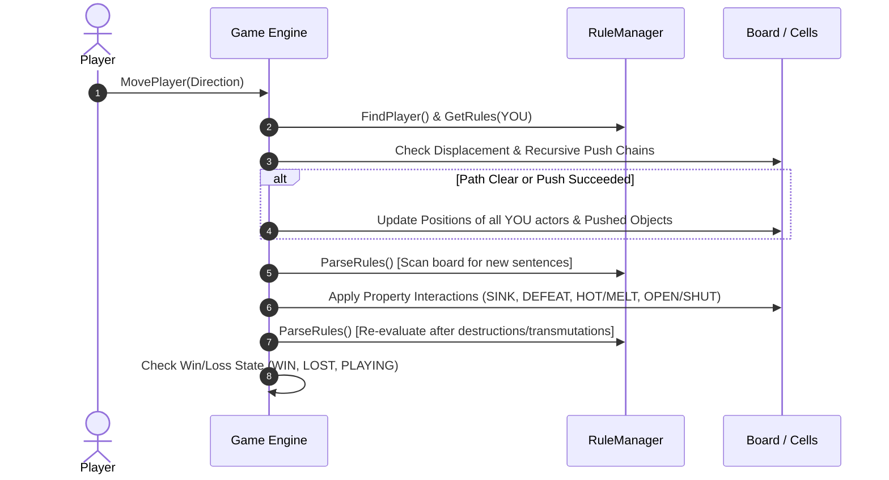

# Baba Is You — Design Patterns, Mechanics Catalog & Extensibility Reference

> **A comprehensive reference distilling architectural paradigms, simulation pipelines, mechanics catalogs, and advanced puzzle design patterns from *Baba Is You* (and the `baba-is-auto` simulation engine) tailored for *SUBTEXT (SIKAPTala)*.**

---

## Table of Contents
1. [Core Paradigm Comparison: Syntactic vs. Semantic Rule Engines](#1-core-paradigm-comparison-syntactic-vs-semantic-rule-engines)
2. [Turn Simulation & Execution Pipelines](#2-turn-simulation--execution-pipelines)
3. [Mechanics & Tag Catalog for Future Expansion](#3-mechanics--tag-catalog-for-future-expansion)
   - [Movement & Physics Modifiers](#movement--physics-modifiers)
   - [Interaction & Destruction Pairs](#interaction--destruction-pairs)
   - [Spatial Conveyance & Teleportation](#spatial-conveyance--teleportation)
   - [Transmutation & Object Synthesis](#transmutation--object-synthesis)
   - [Autonomous & Environmental Behaviors](#autonomous--environmental-behaviors)
4. [Multi-Layer Grid Stacking & Peeling Mechanics](#4-multi-layer-grid-stacking--peeling-mechanics)
5. [Conditional & Relational Rules (Infix Operators)](#5-conditional--relational-rules-infix-operators)
6. [Deterministic Puzzle Verification & Fixture Testing](#6-deterministic-puzzle-verification--fixture-testing)

---

## 1. Core Paradigm Comparison: Syntactic vs. Semantic Rule Engines

| Dimension | *Baba Is You* (`baba-is-auto`) | *SUBTEXT* (SIKAPTala) |
|---|---|---|
| **Rule Representation** | **Global Syntactic Sentences** (`[NOUN] [OPERATOR] [PROPERTY/NOUN]`) formed by physical in-world text tiles. | **Local Semantic Adjectives** (`[HARMFUL]`, `[LIGHT]`, `[CHASING]`) bound directly to objects, entities, or substrate tiles. |
| **Rule Scope** | **Global Broadcast**: Modifying `[ROCK] [IS] [PUSH]` immediately alters every rock across the entire map. | **Localized / Targeted**: Attaching `[LIGHT]` to a specific Crate or Goblin only alters that particular instance. |
| **Interaction Space** | Pushing text blocks in physical space to form orthogonal triples ($3 \times 1$ or $1 \times 3$). | Subtext overlay inspection, hovering, dragging, and dropping tags between objects and grid cells. |
| **Entity Model** | Discrete enum IDs (`ObjectType::BABA`, `ObjectType::ROCK`, `ObjectType::WALL`) queried against an active `RuleManager`. | Universal `GridBody2D` instances with modular `TagRule` strategy dispatching via `TagRegistry`. |
| **Game State Resolution** | Evaluates active grammar graph, moves `YOU` actors, propagates pushes, resolves contacts, re-parses grammar. | Transactional step with undo snapshotting, recursive step resolution, tag interaction dispatch, and autonomous ticks. |

```mermaid
graph TD
    subgraph Baba Is You (Syntactic Global Engine)
        T1[Physical Text Tiles on Board] -->|Parsed Orthogonally| RM[RuleManager Triples: NOUN + IS + PROP]
        RM -->|Broadcast Query| ALL_OBJ[All Matching Objects in World]
    end

    subgraph SUBTEXT (Semantic Local Engine)
        ST[Subtext Overlay / Drag & Drop] -->|Targeted Tag Binding| GB[GridBody2D Instances & Substrate Cells]
        GB -->|Queries Attached Tags| TR[TagRegistry Dispatcher -> TagRule Strategies]
    end
```

---

## 2. Turn Simulation & Execution Pipelines

### The `baba-is-auto` 5-Phase Turn Pipeline

`baba-is-auto` enforces strict separation between player displacement, text realignment, rule recalculation, and contact consequences:



### Lessons for SIKAPTala's Architecture:
1. **Post-Movement Rule Re-evaluation**: When tags are dynamically transferred or spatial overrides are applied mid-turn (e.g. stepping onto an aura tile), the engine should trigger a localized `TagRegistry.notify_tag_added()` refresh before contact effects are resolved.
2. **Deterministic Displacement Before Destruction**: Always calculate full recursive push chains across all participating bodies before applying contact damage (`HARMFUL`, `FRAGILE`), preventing partial moves if a push chain is blocked midway.

---

## 3. Mechanics & Tag Catalog for Future Expansion

The following mechanics from *Baba Is You* can be mapped directly into SUBTEXT as modular `TagRule` strategies inheriting from `scripts/core/tag_rule.gd`:

### Movement & Physics Modifiers

#### 1. `PULL` (Inverse Push)
* **Concept**: When an actor with or facing a `PULL` object steps away, the `PULL` object is dragged along behind them into the vacated cell.
* **TagRule Implementation Pattern**:
```gdscript
# tag_pull.gd
class_name TagPull
extends "res://scripts/core/tag_rule.gd"

func on_actor_stepped_away(puller: Node2D, from_pos: Vector2i, pulled_body: Node2D) -> void:
    if pulled_body.has_method("step"):
        var pull_dir: Vector2i = from_pos - pulled_body.grid_pos
        pulled_body.step(pull_dir)
```

#### 2. `SWAP` (Position Exchange)
* **Concept**: Stepping into a `SWAP` object doesn't block or push; instead, the stepping actor and the target swap positions instantly.
* **TagRule Implementation Pattern**:
```gdscript
# tag_swap.gd
class_name TagSwap
extends "res://scripts/core/tag_rule.gd"

func can_enter(_actor: Node2D, _target_pos: Vector2i, _tags: Array[String]) -> bool:
    return true # Allows entry

func on_enter(actor: Node2D, target_pos: Vector2i, occupant: Node2D) -> void:
    if occupant != null and actor != null:
        var actor_old_pos: Vector2i = actor.grid_pos
        # Exchange coordinates in Grid index
        Grid.vacate(occupant.grid_pos)
        occupant.grid_pos = actor_old_pos
        Grid.occupy(actor_old_pos, occupant)
        occupant.position = Grid.grid_to_world(actor_old_pos)
```

#### 3. `FLOAT` (Hazard Immunity & Layer Separation)
* **Concept**: Objects with `FLOAT` only interact with other `FLOAT` objects. They glide over ground hazards (water, pits, spikes) without triggering `HARMFUL` or `SINK`.
* **TagRule Implementation Pattern**:
```gdscript
# In can_enter / on_enter checks:
if "FLOAT" in actor.tags and not ("FLOAT" in hazard.tags):
    # Hazard does not affect floating actor
    return
```

---

### Interaction & Destruction Pairs

#### 4. `OPEN` & `SHUT` (Key & Lock Annihilation)
* **Concept**: Complementary destruction pair. When an `OPEN` object collides with a `SHUT` object, both objects are destroyed (or unlocked).
* **TagRule Implementation Pattern**:
```gdscript
# tag_open.gd
class_name TagOpen
extends "res://scripts/core/tag_rule.gd"

func on_enter(actor: Node2D, _target_pos: Vector2i, occupant: Node2D) -> void:
    if occupant != null and "SHUT" in occupant.get("tags"):
        actor.die()
        occupant.die()
```

#### 5. `HOT` & `MELT` (Thermal Destruction)
* **Concept**: Asymmetrical destruction. `HOT` objects destroy `MELT` objects upon contact without being consumed themselves.
* **TagRule Implementation Pattern**:
```gdscript
# tag_hot.gd
class_name TagHot
extends "res://scripts/core/tag_rule.gd"

func on_enter(actor: Node2D, _target_pos: Vector2i, occupant: Node2D) -> void:
    if occupant != null and "MELT" in occupant.get("tags"):
        occupant.die()
```

#### 6. `WEAK` (Universal Vulnerability)
* **Concept**: A `WEAK` object shatters and is destroyed whenever *anything* steps on it, pushes it into a wall, or bumps into it.

---

### Spatial Conveyance & Teleportation

#### 7. `TELE` (Linked Wormhole Transit)
* **Concept**: When an actor steps onto an object with `TELE`, they are immediately teleported to another `TELE` object on the map.
* **TagRule Implementation Pattern**:
```gdscript
# tag_tele.gd
class_name TagTele
extends "res://scripts/core/tag_rule.gd"

func on_enter(actor: Node2D, target_pos: Vector2i, _occupant: Node2D) -> void:
    var all_tele_nodes = GameState.get_objects_with_tag("TELE")
    for node in all_tele_nodes:
        if node.grid_pos != target_pos and not GameState.is_tile_blocked(node.grid_pos):
            actor.grid_pos = node.grid_pos
            actor.position = Grid.grid_to_world(node.grid_pos)
            break
```

#### 8. `SHIFT` (Conveyor Belts & Directional Currents)
* **Concept**: Any object standing on top of a `SHIFT` tile/body is forced to step 1 cell in the `SHIFT` object's facing direction on every turn tick.
* **TagRule Implementation Pattern**:
```gdscript
# tag_shift.gd
class_name TagShift
extends "res://scripts/core/tag_rule.gd"

func on_turn_tick(body: Node2D) -> void:
    var occ = Grid.get_occupant(body.grid_pos)
    if occ != null and occ != body:
        var dir: Vector2i = body.get("facing_dir")
        if dir != Vector2i.ZERO and occ.has_method("step"):
            occ.step(dir)
```

---

### Transmutation & Object Synthesis

#### 9. `TRANSMUTING` / `MIMIC` (Identity Morphing)
* **Concept**: In *Baba Is You*, `[ROCK] [IS] [BABA]` morphs all rocks into playable Babas. In SUBTEXT, assigning a noun or identity tag can swap the object's scene representation, sprite, and base properties dynamically via `TileConverter` or scene replacement.

#### 10. `MORE` (Exponential Cellular Growth)
* **Concept**: On turn ticks, any object tagged with `MORE` duplicates itself into adjacent empty cells (UP, DOWN, LEFT, RIGHT). Creates urgent race-against-the-clock puzzle dynamics (e.g. slime/vines overgrowing the room).

---

### Autonomous & Environmental Behaviors

#### 11. `FALL` (Gravity & Pit Hazards)
* **Concept**: On turn ticks, any object with `FALL` drops downward until it lands on an impassable tile, a floor layer, or another solid object.

#### 12. `FEARFUL` / `AFRAID` (Contextual Fleeing)
* **Concept**: Contextual AI. Flee only when within $N$ tiles of an object tagged with a specific opposing tag (e.g. `LIGHT` fleeing from `HARMFUL`, or Goblin fleeing from Fire).

---

## 4. Multi-Layer Grid Stacking & Peeling Mechanics

### The *Baba Is You* Layer Stack
In `baba-is-auto`, each cell is represented as a stack of objects across discrete layers:
```cpp
// baba-is-auto/Games/Object.hpp
std::vector<ObjectType> m_types; // Stacked types at (x, y)
```
When multiple items occupy the same cell (e.g. Baba standing on Grass and a Flag):
1. **Peeling**: When Baba moves, only the `YOU` object leaves the cell; non-`YOU` objects (`Grass`, `Flag`) stay behind.
2. **Stacked Pushing**: If text blocks `[BABA]` and `[IS]` are stacked in the same cell, pushing that cell pushes both text blocks together.

### Recommendation for SIKAPTala
While SIKAPTala currently uses a single occupant per cell in `Grid.occupied`, future expansion for multi-item stacking (e.g., carrying keys, items on carpets, multiple small items on tables) can adopt a layered dictionary:
```gdscript
# Future Grid Layered Occupancy:
var cell_occupants: Dictionary = {} # Vector2i -> Array[Node2D]

func get_top_occupant(pos: Vector2i) -> Node2D
func get_all_occupants(pos: Vector2i) -> Array[Node2D]
```

---

## 5. Conditional & Relational Rules (Infix Operators)

In `baba-is-auto`, rules support condition qualifiers:
- `ON`: `BABA ON ICE IS SLIPPERY`
- `NEAR`: `GOBLIN NEAR PLAYER IS AGGRESSIVE`
- `FACING`: `STATUE FACING PLAYER IS HARMFUL`
- `LONELY`: `ROCK LONELY IS PUSH` (only pushable if no adjacent objects)

### Integrating Contextual Conditions into SIKAPTala's `TagRule`
We can extend `TagRule` with a generic condition evaluator:
```gdscript
class_name ConditionalTagRule
extends "res://scripts/core/tag_rule.gd"

func is_condition_met(body: Node2D) -> bool:
    # Example: Check if standing ON carpet
    var current_tile = Grid.get_floor_tags(body.grid_pos)
    return "CARPET" in current_tile
```
This enables emergent level designs such as:
- **"Conductive"**: Metal crates only become `HARMFUL` when touching electric water.
- **"Slippery"**: Actors only slide when on `ICE` substrate tiles.

---

## 6. Deterministic Puzzle Verification & Fixture Testing

### The `baba-is-auto` Test Pattern
`baba-is-auto` uses plain-text map fixtures (`Resources/Maps/*.txt`) paired with recorded action sequences:
```txt
Map: 01_simple.txt
Inputs: RIGHT, RIGHT, UP, RIGHT
Expected: WON
```

### Applying This in SIKAPTala
Because SIKAPTala now has a fully deterministic, headless-compatible engine (verified in `feat/tag-behavior-engine`), we can build a lightweight automated puzzle regression runner:

```gdscript
# Example test fixture format:
const LEVEL_TESTS = [
    {
        "level": "res://scenes/level_2.tscn",
        "inputs": [Vector2i.RIGHT, Vector2i.RIGHT, Vector2i.UP, Vector2i.DOWN],
        "expected_result": "level_cleared"
    }
]
```

This guarantees that future mechanics, tag additions, and level refactorings will **never break existing puzzle solutions**.
